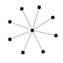
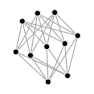
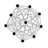
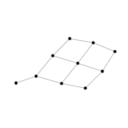
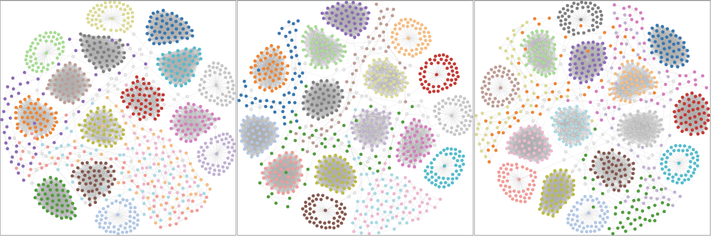

## 简介

### 目的

检测动态图中，相似动态子图查找算法的有效性。

当输入动态子图，检测到它的相似动态子图的precision和recall。

- precision：$P=\frac{TP}{TP+FP}$，即检测到的结果中，真正与原图相似的子图的比例。
- recall：$R=\frac{TP}{TP+FN}$，即检测到的结果中真正与原图相似的子图，占所有分类正确的结果（没有检测到的与原图不相似的子图+检测到的与原图相似的子图）

### 数据构造情况

目前加入的数据结构：

这些社团会通过一些简单的路径相连，形成一个连通子图。比如，使用环状路径来连接这些子图：

现在将这种不同的社团结构称为group，每个group会随着时间在这几种结构中随机变化，但节点数量不变。

### 使用

1. 生成数据：

   app.py可以用于生成数据，依赖包：networkx（2.2），参数有4个：

   - `time_count`（动态图的帧数）
   - `nodes_count`（每一帧的节点总数）
   - `community_count`（每一帧的group的个数）
   - `path_length`（连接不同group之间路径长度，指该路径上边的数量）

   `python ./src/app.py`即可运行（python3）

2. 可视化：

   运行`python -m SimpleHTTPServer 2333`，启动服务器后，打开`http://localhost:2333/output/force.html`，当点击某个节点后，可以观察这个节点所在社团的时序变化

